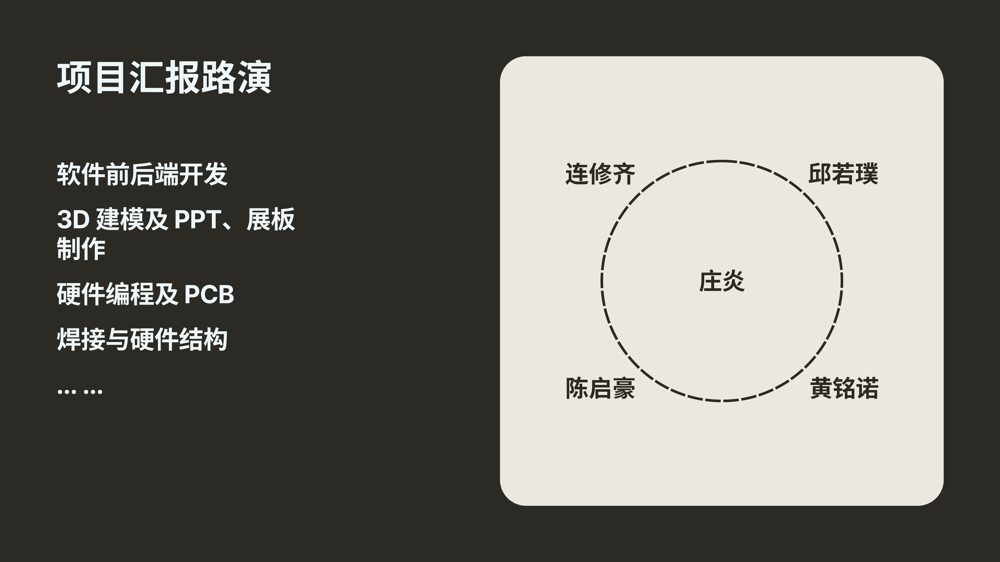
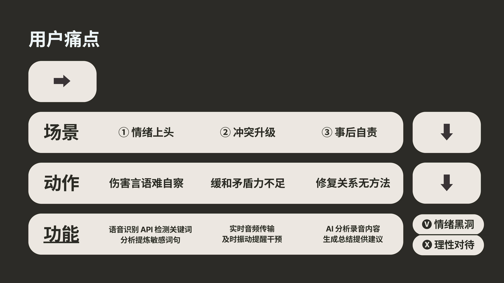
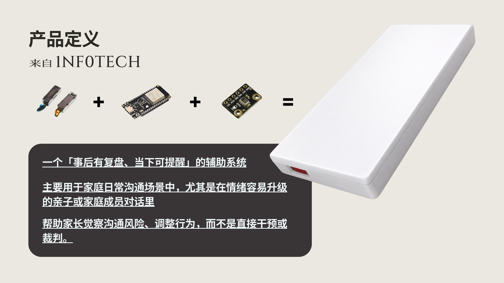
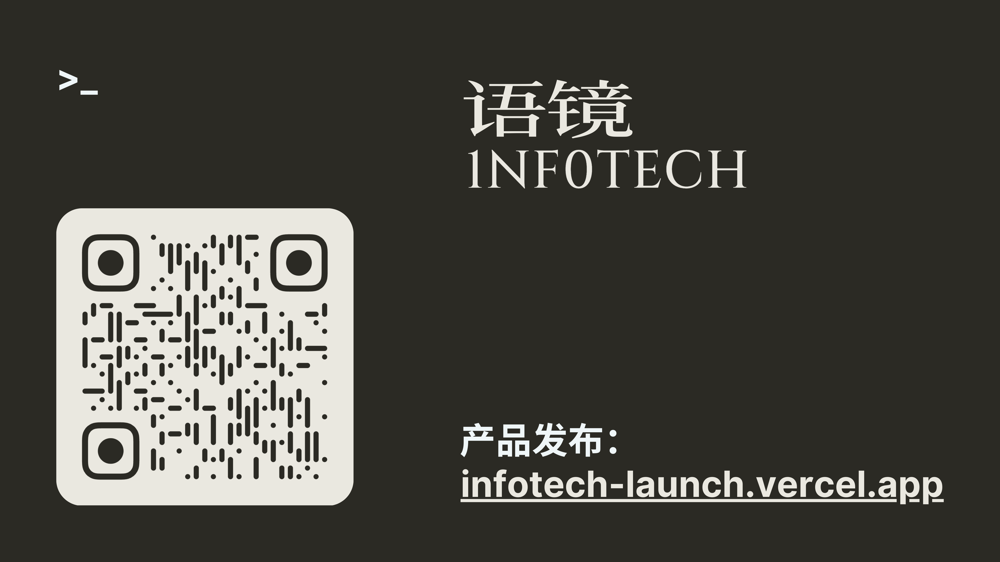
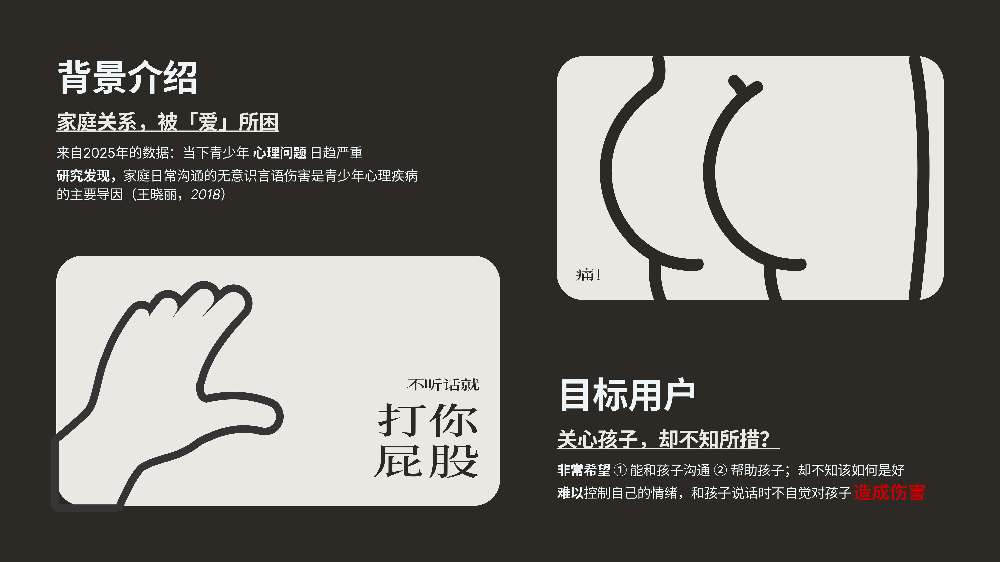
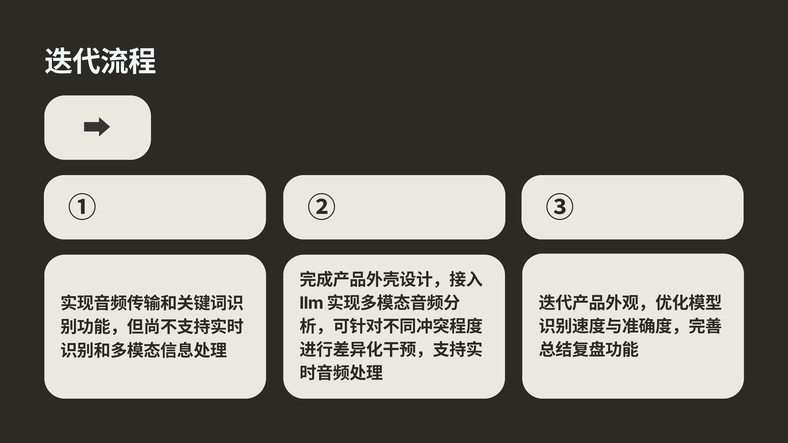
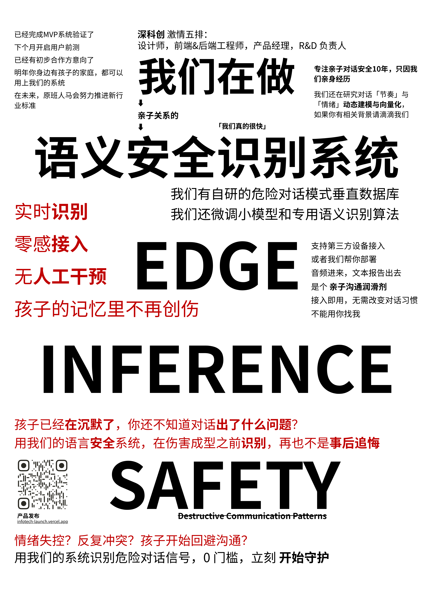
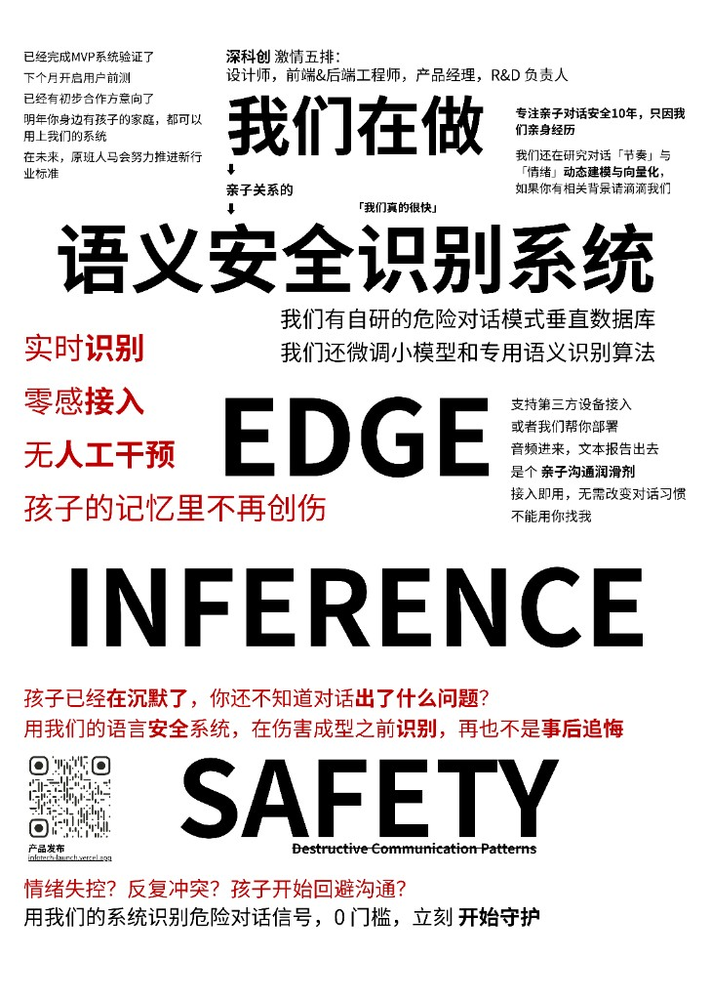

# 语镜 · 宣言

> **在伤害成型之前，把对话接住。**  
> 愿孩子的记忆里，少一道不该有的疤。

语镜 INFO-TECH · Dialog Safety Infra for Families

  
  

---

**目录** · [品牌](#品牌) · [我们看见的问题](#我们看见的问题) · [用户痛点](#用户痛点--我们怎么接住) · [产品定义](#产品定义) · [迭代与路线](#迭代与路线) · [愿景与系统](#愿景与系统) · [团队与汇报](#团队与汇报) · [产品发布](#产品发布) · [我们整了个大活](#我们整了个大活)

---

## 品牌

**语镜** · INFOTECH — 家庭对话的语义安全层

---

## 我们看见的问题

家庭关系，常被「爱」所困：很多家长非常希望能和孩子沟通、帮助孩子，却不知该如何是好；情绪上来时难以自控，和孩子说话时**不自觉地造成伤害**。  
研究指出，**家庭日常沟通中的无意识言语伤害**是青少年心理问题的重要导因（王晓丽，2018）。来自 2025 年的数据与既往研究均显示：当下青少年心理问题日趋严重——我们做语镜，就是为了在这个问题上做一点可用的东西。

**目标用户**：关心孩子、却不知所措的家长。不评判对错，只帮忙看见、提醒、复盘。

---

## 用户痛点 → 我们怎么接住

从**情绪上头**到**冲突升级**再到**事后自责**，每一个环节都有具体的难处；语镜用三种能力分别接住：**实时识别敏感词句**、**振动提醒干预**、**AI 复盘与建议**。目标不是事后追悔，而是从**情绪黑洞**走向**理性对待**。

| 场景 | 难处 | 语镜做什么 |
|------|------|------------|
| ① 情绪上头 | 伤害言语难自察 | 语音识别 API 检测关键词，分析提炼敏感词句 |
| ② 冲突升级 | 缓和矛盾力不足 | 实时音频传输，及时振动提醒干预 |
| ③ 事后自责 | 修复关系无方法 | AI 分析录音内容，生成总结、提供建议 |

---

## 产品定义

语镜是一个「**事后有复盘、当下可提醒**」的辅助系统——不是监控，也不是裁判。  
主要用于家庭日常沟通，尤其是在情绪容易升级的亲子或家庭成员对话里；**帮助家长觉察沟通风险、调整行为**，而不是直接干预或代替你说话。  
产品形态：麦克风 + 主控（如 ESP32）+ 触觉/传感器模块 → 简洁的白色设备，零感接入；音频进、报告出，数据不出家门。

---

## 迭代与路线

我们按阶段推进：先打通**音频传输与关键词识别**，再完成**产品外壳**并接入 **LLM 多模态分析**、按冲突程度差异化干预、支持实时处理，最后**迭代外观与模型**、完善总结复盘功能。

---

## 愿景与系统

**语义安全识别系统**：实时识别、零感接入、无人工干预。  
我们有自研的危险对话模式垂直数据库，微调小模型与专用语义识别算法；支持第三方设备接入或由我们协助部署。**音频进来，文本报告出去**——是亲子沟通的润滑剂，接入即用，无需改变对话习惯。  
我们相信：**孩子的记忆里，不再有创伤**。用我们的系统，在伤害成型之前识别危险对话信号，零门槛，立刻开始守护。

---

## 团队与汇报

深科创 · 激情五排：设计师、前端&后端工程师、产品经理、R&D 负责人。  
软件前后端开发、3D 建模及 PPT/展板、硬件编程及 PCB、焊接与硬件结构——我们一起把语镜从想法做到可用的产品。

---

## 产品发布

官网与产品发布页：**[infotech-launch.vercel.app](https://infotech-launch.vercel.app)**  
加入等待列表、了解原理与路线图，都在这里。

---

## 我们整了个大活

---

---

**语镜** — Dialog Safety Infra for Families  
在伤害成型之前，让对话回到安全区。

[**官网**](https://infotech-launch.vercel.app/) · [**GitHub 组织**](https://github.com/Info-Tech-org) · [**Dialog**](https://github.com/Info-Tech-org/Dialog) · [**Dialog_HardWare**](https://github.com/Info-Tech-org/Dialog_HardWare)（硬件/固件）

  

